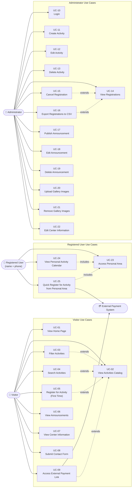

# Use Cases Document
## Beit Hoffman Website – Information, Activities and Registration for Senior Citizens

**Version:** 1.1  
**Date:** June 2026  
**Status:** Final Draft

---

## Table of Contents

1. [Introduction](#introduction)
2. [Actors](#actors)
3. [Use Case List](#use-case-list)
4. [Detailed Use Case Descriptions](#detailed-use-case-descriptions)
   - [Visitor Use Cases](#visitor-use-cases)
   - [Administrator Use Cases](#administrator-use-cases)
   - [Registered User Use Cases](#registered-user-use-cases)
5. [Use Case Diagram](#use-case-diagram)

---

## Introduction

This document describes the use cases for the Beit Hoffman Website – a web-based information and registration platform serving senior citizens and their families. The use cases are derived from the Software Requirements Specification (SRS) and aligned with the identified user personas: **Sarah Cohen** (senior citizen visitor), **David Levi** (family member), and **Miriam Ben-David** (site administrator).

The document covers all major visitor interactions and administrative operations.

---

## Actors

| Actor | Description | Persona Reference |
|---|---|---|
| **Visitor** | Any unauthenticated user browsing the website; includes senior citizens and their family members | Sarah Cohen, David Levi |
| **Registered User** | Any visitor who has previously registered for at least one activity and can access the personal area by entering their full name and phone number; no account creation or password is required. A stored user profile is created upon first registration and is used to enable quick registration for subsequent activities. | Sarah Cohen, David Levi |
| **Administrator** | Authenticated staff member of Beit Hoffman with access to the administration panel | Miriam Ben-David |
| **External Payment System** | Third-party payment service linked for paid activities (external actor) | — |

---

## Use Case List

| Use Case ID | Use Case Name | Primary Actor |
|---|---|---|
| UC-01 | View Home Page | Visitor |
| UC-02 | View Activities Catalog | Visitor |
| UC-03 | Filter Activities | Visitor |
| UC-04 | Search Activities | Visitor |
| UC-05 | Register for Activity (First Time) | Visitor |
| UC-06 | View Announcements | Visitor |
| UC-07 | View Center Information | Visitor |
| UC-08 | Submit Contact Form | Visitor |
| UC-09 | Access External Payment Link | Visitor |
| UC-10 | Login | Administrator |
| UC-11 | Create Activity | Administrator |
| UC-12 | Edit Activity | Administrator |
| UC-13 | Delete Activity | Administrator |
| UC-14 | View Registrations | Administrator |
| UC-15 | Cancel Registration | Administrator |
| UC-16 | Export Registrations to CSV | Administrator |
| UC-17 | Publish Announcement | Administrator |
| UC-18 | Edit Announcement | Administrator |
| UC-19 | Delete Announcement | Administrator |
| UC-20 | Upload Gallery Images | Administrator |
| UC-21 | Remove Gallery Images | Administrator |
| UC-22 | Edit Center Information | Administrator |
| UC-23 | Access Personal Area | Registered User |
| UC-24 | View Personal Activity Calendar | Registered User |
| UC-25 | Quick Register for Activity from Personal Area | Registered User |

---

## Detailed Use Case Descriptions

---

### Visitor Use Cases

---

#### UC-01 – View Home Page

| Field | Details |
|---|---|
| **Use Case ID** | UC-01 |
| **Use Case Name** | View Home Page |
| **Primary Actor** | Visitor |
| **Goal** | The visitor arrives at the home page and views a summary of upcoming events, recent announcements, and the photo gallery. |

**Preconditions:**
- The visitor has navigated to the website's root URL.
- The website is accessible and the server is running.

**Main Flow:**

1. The visitor opens the website in a browser.
2. The system loads the home page.
3. The system displays the next 5 upcoming events, sorted by date in ascending order (FR-01).
4. The system displays the 3 most recent announcements (FR-02).
5. The system displays the photo gallery containing uploaded images (FR-03).
6. The visitor browses the displayed content.

**Alternative Flows:**

- **AF-01A – Fewer than 5 upcoming events exist:** The system displays all available upcoming events without padding.
- **AF-01B – No announcements exist:** The announcements section is empty or hidden.
- **AF-01C – No gallery images exist:** The gallery section is empty or displays a placeholder message.

**Postconditions:**
- The visitor has viewed the home page content.
- No data is modified.

---

#### UC-02 – View Activities Catalog

| Field | Details |
|---|---|
| **Use Case ID** | UC-02 |
| **Use Case Name** | View Activities Catalog |
| **Primary Actor** | Visitor |
| **Goal** | The visitor browses the full list of active activities including their title, category, schedule, and available spots. |

**Preconditions:**
- The visitor has navigated to the Activities Catalog page.
- At least one active activity exists in the system.

**Main Flow:**

1. The visitor navigates to the Activities Catalog page.
2. The system retrieves and displays all active activities (FR-04).
3. For each activity, the system displays: title, category, day, time, and number of available spots.
4. The visitor browses the activity listings.

**Alternative Flows:**

- **AF-02A – No active activities exist:** The system displays a message indicating that no activities are currently available.
- **AF-02B – Activity is full:** The activity is displayed with available spots shown as 0 and the registration button is disabled (FR-11).

**Postconditions:**
- The visitor has viewed the list of available activities.
- No data is modified.

---

#### UC-03 – Filter Activities

| Field | Details |
|---|---|
| **Use Case ID** | UC-03 |
| **Use Case Name** | Filter Activities |
| **Primary Actor** | Visitor |
| **Goal** | The visitor filters the activities catalog by category or day of the week to find relevant activities. |

**Preconditions:**
- The visitor is on the Activities Catalog page.
- Activities with varying categories and days exist in the system.

**Main Flow:**

1. The visitor views the Activities Catalog (UC-02).
2. The visitor selects a category filter from the available options (FR-05).
3. The system refreshes the list to display only activities matching the selected category.
4. Optionally, the visitor selects a day-of-week filter (FR-06).
5. The system further refines the list to display only activities on the selected day.
6. The visitor reviews the filtered results.

**Alternative Flows:**

- **AF-03A – No activities match the selected filter:** The system displays a message indicating no activities were found for the selected criteria.
- **AF-03B – Visitor clears filters:** The system reverts to displaying the full list of active activities.

**Postconditions:**
- The visitor views a filtered subset of activities.
- No data is modified.

---

#### UC-04 – Search Activities

| Field | Details |
|---|---|
| **Use Case ID** | UC-04 |
| **Use Case Name** | Search Activities |
| **Primary Actor** | Visitor |
| **Goal** | The visitor searches for specific activities using a keyword and receives matching results. |

**Preconditions:**
- The visitor is on the Activities Catalog page.
- A search input field is visible.

**Main Flow:**

1. The visitor types a keyword into the search field (FR-13).
2. The system searches activity titles and descriptions for the keyword.
3. The system displays a list of activities that contain the keyword.
4. The visitor reviews the search results.

**Alternative Flows:**

- **AF-04A – No matching results found:** The system displays a message indicating that no activities were found for the entered keyword.
- **AF-04B – Visitor clears the search field:** The system reverts to displaying the full activities catalog.

**Postconditions:**
- The visitor views activities matching the entered keyword.
- No data is modified.

---

#### UC-05 – Register for Activity (First Time)

| Field | Details |
|---|---|
| **Use Case ID** | UC-05 |
| **Use Case Name** | Register for Activity (First Time) |
| **Primary Actor** | Visitor |
| **Goal** | A first-time visitor submits a registration form to enroll in an activity. A user profile is created from the submitted personal details for use in future registrations. |

**Preconditions:**
- The visitor is viewing the Activities Catalog.
- The desired activity is active and has available spots.
- The activity's registration button is enabled.

**Main Flow:**

1. The visitor clicks the registration button for the desired activity (FR-07).
2. The system displays a registration form.
3. The visitor fills in the required fields: identity number, full name, and phone number (FR-08).
4. The visitor provides an email address.
5. The selected activity is pre-populated or selected by the visitor in the form.
6. The visitor submits the form.
7. The system validates all required fields.
8. The system checks that no existing registration exists for the same phone number and activity (FR-10).
9. The system saves the registration to the database.
10. The system creates or updates a user profile record storing the identity number, full name, phone number, and email, keyed by phone number (FR-39).
11. The system displays a confirmation message in Hebrew within 2 seconds (FR-09).

**Alternative Flows:**

- **AF-05A – Required fields are missing:** The system displays a validation error in Hebrew and prevents submission.
- **AF-05B – Duplicate registration detected (same phone number and activity):** The system displays an error message in Hebrew informing the visitor that they are already registered.
- **AF-05C – Activity becomes fully booked between page load and submission:** The system displays a message in Hebrew informing the visitor that the activity is no longer available.
- **AF-05D – Server error during submission:** The system displays a generic error message and instructs the visitor to try again.

**Postconditions:**
- A new registration record is saved to the database, storing the identity number, full name, phone number, and selected activity.
- A user profile record is created or updated for the submitted phone number (FR-39).
- The available spots count for the activity is decremented by one.
- The visitor receives a confirmation message.
- The registration is immediately retrievable through the personal area using the same full name and phone number (FR-34, FR-35).

---

#### UC-06 – View Announcements

| Field | Details |
|---|---|
| **Use Case ID** | UC-06 |
| **Use Case Name** | View Announcements |
| **Primary Actor** | Visitor |
| **Goal** | The visitor navigates to the Announcements page and reads all published announcements sorted by publication date. |

**Preconditions:**
- The visitor has navigated to the Announcements page.
- At least one announcement has been published.

**Main Flow:**

1. The visitor navigates to the Announcements page.
2. The system retrieves all published announcements sorted by publication date in descending order (FR-14).
3. The system displays the announcements list to the visitor.
4. The visitor reads the announcements.

**Alternative Flows:**

- **AF-06A – No announcements exist:** The system displays a message indicating that no announcements are currently available.

**Postconditions:**
- The visitor has viewed the announcements.
- No data is modified.

---

#### UC-07 – View Center Information

| Field | Details |
|---|---|
| **Use Case ID** | UC-07 |
| **Use Case Name** | View Center Information |
| **Primary Actor** | Visitor |
| **Goal** | The visitor accesses the Information page to view the center's address, opening hours, contact details, and location map. |

**Preconditions:**
- The visitor has navigated to the Information page.
- Center information has been configured by an administrator.

**Main Flow:**

1. The visitor navigates to the Information page.
2. The system displays: center address, opening hours, phone number, email address, and an embedded Google Map (FR-15).
3. The visitor reads the center information and interacts with the map if needed.

**Alternative Flows:**

- **AF-07A – Center information has not been configured:** The system displays placeholder or default content.
- **AF-07B – Google Map fails to load:** The map area displays an error message; other information remains visible.

**Postconditions:**
- The visitor has viewed the center information.
- No data is modified.

---

#### UC-08 – Submit Contact Form

| Field | Details |
|---|---|
| **Use Case ID** | UC-08 |
| **Use Case Name** | Submit Contact Form |
| **Primary Actor** | Visitor |
| **Goal** | The visitor submits a contact request to Beit Hoffman staff through the contact form. |

**Preconditions:**
- The visitor has navigated to the Contact page.
- The contact form is displayed.

**Main Flow:**

1. The visitor navigates to the Contact page.
2. The system displays the contact form.
3. The visitor fills in the required fields: name, email, subject, and message (FR-16).
4. The visitor submits the form.
5. The system validates all fields.
6. The system stores the contact request in the database (FR-17).
7. The system displays a confirmation message to the visitor.

**Alternative Flows:**

- **AF-08A – Required fields are missing or invalid:** The system displays validation error messages in Hebrew and prevents submission.
- **AF-08B – Server error during submission:** The system displays a generic error and asks the visitor to try again.

**Postconditions:**
- The contact request is stored and accessible to authenticated administrators.
- The visitor receives a submission confirmation.

---

#### UC-09 – Access External Payment Link

| Field | Details |
|---|---|
| **Use Case ID** | UC-09 |
| **Use Case Name** | Access External Payment Link |
| **Primary Actor** | Visitor |
| **Goal** | The visitor accesses the external payment system link for a paid activity. |

**Preconditions:**
- The visitor is viewing an activity that requires payment.
- The activity has an external payment link configured.

**Main Flow:**

1. The visitor views a paid activity in the Activities Catalog.
2. The system displays an external payment link for the activity (FR-12).
3. The visitor clicks the payment link.
4. The system redirects the visitor to the external payment system in a new tab or window.
5. The visitor completes payment on the external system.

**Alternative Flows:**

- **AF-09A – Payment link is unavailable or broken:** The external system returns an error; the visitor is advised to contact the center directly.

**Postconditions:**
- The visitor has been redirected to the external payment system.
- No data is stored within the Beit Hoffman website for this transaction.

---

### Administrator Use Cases

---

#### UC-10 – Login

| Field | Details |
|---|---|
| **Use Case ID** | UC-10 |
| **Use Case Name** | Login |
| **Primary Actor** | Administrator |
| **Goal** | The administrator authenticates with username and password to access the administration panel. |

**Preconditions:**
- The administrator has a valid username and password.
- The login page is accessible.

**Main Flow:**

1. The administrator navigates to the administration login page.
2. The system displays the login form.
3. The administrator enters their username and password (FR-32).
4. The administrator submits the form.
5. The system validates the credentials against stored hashed passwords (NFR-14).
6. The system creates an authenticated session.
7. The system redirects the administrator to the administration dashboard.

**Alternative Flows:**

- **AF-10A – Invalid credentials:** The system displays an error message and remains on the login page. No session is created.
- **AF-10B – Session has expired due to inactivity (60 minutes):** The system redirects the administrator to the login page and displays a session expiry message (FR-33).
- **AF-10C – Unauthorized access attempt to admin API:** The system returns HTTP 401 (NFR-15).

**Postconditions:**
- The administrator is authenticated and has an active session.
- The administrator is redirected to the administration dashboard.

---

#### UC-11 – Create Activity

| Field | Details |
|---|---|
| **Use Case ID** | UC-11 |
| **Use Case Name** | Create Activity |
| **Primary Actor** | Administrator |
| **Goal** | The administrator creates a new activity and publishes it to the public website. |

**Preconditions:**
- The administrator is authenticated (UC-10).
- The administrator is on the Activities management page in the administration panel.

**Main Flow:**

1. The administrator clicks the "Create New Activity" button.
2. The system displays a blank activity creation form.
3. The administrator enters the activity details: title, category, day, time, participant limit, and optionally a description and payment link (FR-20).
4. The administrator submits the form.
5. The system validates all required fields.
6. The system saves the activity to the database.
7. The activity becomes visible in the public Activities Catalog.

**Alternative Flows:**

- **AF-11A – Required fields are missing:** The system displays validation errors and prevents saving.
- **AF-11B – Server error during save:** The system displays an error message and the activity is not created.

**Postconditions:**
- The new activity is saved to the database.
- The activity is immediately visible in the public Activities Catalog.

---

#### UC-12 – Edit Activity

| Field | Details |
|---|---|
| **Use Case ID** | UC-12 |
| **Use Case Name** | Edit Activity |
| **Primary Actor** | Administrator |
| **Goal** | The administrator modifies the details of an existing activity. |

**Preconditions:**
- The administrator is authenticated (UC-10).
- At least one activity exists in the system.

**Main Flow:**

1. The administrator navigates to the Activities management page.
2. The administrator selects an activity and clicks "Edit."
3. The system displays the activity form pre-populated with existing data.
4. The administrator modifies one or more fields (FR-21).
5. The administrator saves the changes.
6. The system validates the updated data.
7. The system saves the changes to the database.
8. The updated activity is immediately reflected in the public catalog.

**Alternative Flows:**

- **AF-12A – Required fields are cleared:** The system displays validation errors and prevents saving.
- **AF-12B – Administrator cancels editing:** No changes are saved.
- **AF-12C – maxParticipants is changed:** The system recalculates availableSpots as maxParticipants minus currentParticipants.

**Postconditions:**
- The activity record is updated in the database.
- The updated information is immediately visible in the public Activities Catalog.

---

#### UC-13 – Delete Activity

| Field | Details |
|---|---|
| **Use Case ID** | UC-13 |
| **Use Case Name** | Delete Activity |
| **Primary Actor** | Administrator |
| **Goal** | The administrator permanently removes an activity from the system. |

**Preconditions:**
- The administrator is authenticated (UC-10).
- At least one activity exists in the system.

**Main Flow:**

1. The administrator navigates to the Activities management page.
2. The administrator selects an activity and clicks "Delete."
3. The system displays a confirmation dialog.
4. The administrator confirms the deletion (FR-22).
5. The system removes the activity record from the database.
6. The activity is no longer visible in the public Activities Catalog.

**Alternative Flows:**

- **AF-13A – Administrator cancels the confirmation dialog:** No changes are made.

**Postconditions:**
- The activity record is permanently removed from the database.
- The activity no longer appears in the public Activities Catalog.

---

#### UC-14 – View Registrations

| Field | Details |
|---|---|
| **Use Case ID** | UC-14 |
| **Use Case Name** | View Registrations |
| **Primary Actor** | Administrator |
| **Goal** | The administrator views all participant registrations across activities. |

**Preconditions:**
- The administrator is authenticated (UC-10).
- At least one registration exists in the system.

**Main Flow:**

1. The administrator navigates to the Registrations management page.
2. The system retrieves and displays all registrations (FR-23).
3. For each registration, the system displays: participant identity number, full name, phone number, email, and the registered activity.
4. The administrator reviews the registrations list.

**Alternative Flows:**

- **AF-14A – No registrations exist:** The system displays a message indicating no registrations have been submitted.
- **AF-14B – Administrator filters registrations by activity:** The system displays only registrations for the selected activity.

**Postconditions:**
- The administrator has viewed the registrations list.
- No data is modified.

---

#### UC-15 – Cancel Registration

| Field | Details |
|---|---|
| **Use Case ID** | UC-15 |
| **Use Case Name** | Cancel Registration |
| **Primary Actor** | Administrator |
| **Goal** | The administrator cancels a participant's registration for an activity. |

**Preconditions:**
- The administrator is authenticated (UC-10).
- At least one registration exists in the system.

**Main Flow:**

1. The administrator navigates to the Registrations management page (UC-14).
2. The administrator selects a registration and clicks "Cancel."
3. The system displays a confirmation dialog.
4. The administrator confirms the cancellation (FR-24).
5. The system removes the registration record from the database.
6. The available spots count for the activity is incremented by one.

**Alternative Flows:**

- **AF-15A – Administrator cancels the confirmation dialog:** No changes are made.

**Postconditions:**
- The registration is permanently removed from the database.
- The available spots for the activity are updated.

---

#### UC-16 – Export Registrations to CSV

| Field | Details |
|---|---|
| **Use Case ID** | UC-16 |
| **Use Case Name** | Export Registrations to CSV |
| **Primary Actor** | Administrator |
| **Goal** | The administrator exports all or filtered registration data to a CSV file. |

**Preconditions:**
- The administrator is authenticated (UC-10).
- At least one registration exists in the system.

**Main Flow:**

1. The administrator navigates to the Registrations management page.
2. The administrator clicks the "Export to CSV" button (FR-25).
3. The system compiles the registration data into CSV format, including the identity number field.
4. The system initiates a file download in the administrator's browser.
5. The administrator saves the CSV file to their local device.

**Alternative Flows:**

- **AF-16A – No registrations exist:** The system exports a CSV file containing only the header row.

**Postconditions:**
- A CSV file containing registration data (including identity numbers) is downloaded to the administrator's device.
- No data in the system is modified.

---

#### UC-17 – Publish Announcement

| Field | Details |
|---|---|
| **Use Case ID** | UC-17 |
| **Use Case Name** | Publish Announcement |
| **Primary Actor** | Administrator |
| **Goal** | The administrator creates and publishes a new announcement visible to all visitors. |

**Preconditions:**
- The administrator is authenticated (UC-10).
- The administrator is on the Announcements management page.

**Main Flow:**

1. The administrator clicks the "New Announcement" button.
2. The system displays a blank announcement form.
3. The administrator enters the announcement title and body content (FR-26).
4. The administrator submits the form.
5. The system validates the required fields.
6. The system saves the announcement and sets the publication date to the current date and time.
7. The announcement is immediately visible on the public Announcements page and may appear on the home page if it is among the three most recent (FR-02, FR-14).

**Alternative Flows:**

- **AF-17A – Required fields are empty:** The system displays validation errors and prevents publishing.

**Postconditions:**
- The announcement is saved to the database with a publication timestamp.
- The announcement is immediately visible on the public website.

---

#### UC-18 – Edit Announcement

| Field | Details |
|---|---|
| **Use Case ID** | UC-18 |
| **Use Case Name** | Edit Announcement |
| **Primary Actor** | Administrator |
| **Goal** | The administrator modifies an existing published announcement. |

**Preconditions:**
- The administrator is authenticated (UC-10).
- At least one announcement exists in the system.

**Main Flow:**

1. The administrator navigates to the Announcements management page.
2. The administrator selects an announcement and clicks "Edit."
3. The system displays the announcement form pre-populated with existing content.
4. The administrator modifies the title or body (FR-27).
5. The administrator saves the changes.
6. The system validates the updated data.
7. The system updates the announcement record in the database.
8. The updated announcement is immediately visible on the public website.

**Alternative Flows:**

- **AF-18A – Required fields are cleared:** The system displays validation errors and prevents saving.
- **AF-18B – Administrator cancels editing:** No changes are saved.

**Postconditions:**
- The announcement record is updated in the database.
- The updated content is immediately visible on the public website.

---

#### UC-19 – Delete Announcement

| Field | Details |
|---|---|
| **Use Case ID** | UC-19 |
| **Use Case Name** | Delete Announcement |
| **Primary Actor** | Administrator |
| **Goal** | The administrator permanently removes a published announcement. |

**Preconditions:**
- The administrator is authenticated (UC-10).
- At least one announcement exists in the system.

**Main Flow:**

1. The administrator navigates to the Announcements management page.
2. The administrator selects an announcement and clicks "Delete."
3. The system displays a confirmation dialog.
4. The administrator confirms the deletion (FR-28).
5. The system removes the announcement record from the database.
6. The announcement is no longer visible on the public website.

**Alternative Flows:**

- **AF-19A – Administrator cancels the confirmation dialog:** No changes are made.

**Postconditions:**
- The announcement record is permanently removed from the database.
- The announcement no longer appears on the public website.

---

#### UC-20 – Upload Gallery Images

| Field | Details |
|---|---|
| **Use Case ID** | UC-20 |
| **Use Case Name** | Upload Gallery Images |
| **Primary Actor** | Administrator |
| **Goal** | The administrator uploads one or more images to the public photo gallery. |

**Preconditions:**
- The administrator is authenticated (UC-10).
- The administrator has image files ready for upload.

**Main Flow:**

1. The administrator navigates to the Media management page.
2. The administrator clicks "Upload Images" and selects one or more image files (FR-29).
3. The system uploads the selected images.
4. The system stores the images and makes them available in the public gallery.
5. The uploaded images are immediately visible in the home page gallery (FR-03).

**Alternative Flows:**

- **AF-20A – Unsupported file format selected:** The system rejects the file and displays an error message.
- **AF-20B – File size exceeds allowed limit:** The system rejects the file and displays an error message.
- **AF-20C – Upload fails due to server error:** The system displays an error message and no images are saved.

**Postconditions:**
- The uploaded images are stored in the system.
- The images are visible in the public photo gallery.

---

#### UC-21 – Remove Gallery Images

| Field | Details |
|---|---|
| **Use Case ID** | UC-21 |
| **Use Case Name** | Remove Gallery Images |
| **Primary Actor** | Administrator |
| **Goal** | The administrator removes one or more images from the public photo gallery. |

**Preconditions:**
- The administrator is authenticated (UC-10).
- At least one image exists in the gallery.

**Main Flow:**

1. The administrator navigates to the Media management page.
2. The administrator selects the image(s) to remove and clicks "Delete" (FR-30).
3. The system displays a confirmation dialog.
4. The administrator confirms the deletion.
5. The system removes the image files and their records from the system.
6. The deleted images no longer appear in the public gallery.

**Alternative Flows:**

- **AF-21A – Administrator cancels the confirmation dialog:** No images are deleted.

**Postconditions:**
- The selected images are permanently removed from the system.
- The public gallery no longer displays the removed images.

---

#### UC-22 – Edit Center Information

| Field | Details |
|---|---|
| **Use Case ID** | UC-22 |
| **Use Case Name** | Edit Center Information |
| **Primary Actor** | Administrator |
| **Goal** | The administrator updates the center's public information including name, address, contact details, opening hours, and about content. |

**Preconditions:**
- The administrator is authenticated (UC-10).
- The administrator is on the Center Information management page.

**Main Flow:**

1. The administrator navigates to the Center Information page in the administration panel.
2. The system displays the current center information in an editable form.
3. The administrator modifies one or more fields: center name, address, phone number, email, opening hours, or about content (FR-31).
4. The administrator saves the changes.
5. The system validates the updated data.
6. The system saves the changes to the database.
7. The updated information is immediately reflected on the public Information page (FR-15).

**Alternative Flows:**

- **AF-22A – Required fields are cleared:** The system displays validation errors and prevents saving.
- **AF-22B – Administrator cancels editing:** No changes are saved.

**Postconditions:**
- The center information record is updated in the database.
- The updated information is immediately visible on the public Information page.

---

### Registered User Use Cases

---

#### UC-23 – Access Personal Area

| Field | Details |
|---|---|
| **Use Case ID** | UC-23 |
| **Use Case Name** | Access Personal Area |
| **Primary Actor** | Registered User |
| **Goal** | The user enters their full name and phone number to access the personal area, where they can view their registered activities calendar and register for additional activities without re-entering personal details. |

**Preconditions:**
- The user has navigated to the Personal Area page.
- The user has previously registered for at least one activity using the same full name and phone number, so a user profile record exists in the system.

**Main Flow:**

1. The user navigates to the Personal Area page.
2. The system displays a form requesting full name and phone number.
3. The user enters their full name and phone number.
4. The user submits the form.
5. The system validates that both fields are filled in.
6. The system looks up all registration records and the stored user profile matching the exact full name and phone number combination (FR-35, FR-40).
7. Matching registrations and a user profile are found.
8. The system filters the registrations to include only future activities, sorted by activity date in ascending order (FR-36).
9. The system displays the personal area, which includes:
   - The personal activity calendar (UC-24)
   - A list of available activities the user can register for (FR-44)

**Alternative Flows:**

- **AF-23A – Required fields are missing:** The system displays a validation error in Hebrew and prevents submission.
- **AF-23B – No matching registrations found:** The system displays an informative message in Hebrew indicating that no registered activities were found for the entered details (FR-38). No calendar is displayed.
- **AF-23C – Server error during lookup:** The system displays a generic error message and instructs the user to try again.

**Postconditions:**
- The system displays the personal activity calendar containing the user's upcoming registered activities.
- The system displays a list of available activities with quick registration buttons.
- The user's stored profile is loaded and available for quick registration (FR-40, FR-41).
- No data is created or modified during access.

---

#### UC-24 – View Personal Activity Calendar

| Field | Details |
|---|---|
| **Use Case ID** | UC-24 |
| **Use Case Name** | View Personal Activity Calendar |
| **Primary Actor** | Registered User |
| **Goal** | The user views a calendar listing all future activities they are registered for, with full schedule details for each activity. |

**Preconditions:**
- The user has successfully completed UC-23 (Access Personal Area).
- At least one future activity matching the user's registrations exists in the system.

**Main Flow:**

1. The system retrieves all future activity records linked to the user's matching registrations (FR-36).
2. The system displays a calendar sorted by activity date in ascending order.
3. For each activity, the system displays: title, category, date, day of the week, and time (FR-37).
4. The user reviews their upcoming activities.

**Alternative Flows:**

- **AF-24A – All matching registrations are for past activities:** The system displays an informative message in Hebrew indicating that there are no upcoming registered activities. The empty calendar state is shown rather than no page at all.

**Postconditions:**
- The user has viewed their upcoming registered activities.
- No data is created or modified.

---

#### UC-25 – Quick Register for Activity from Personal Area

| Field | Details |
|---|---|
| **Use Case ID** | UC-25 |
| **Use Case Name** | Quick Register for Activity from Personal Area |
| **Primary Actor** | Registered User |
| **Goal** | A returning user registers for an additional activity from within the personal area without re-entering any personal details. The system uses the stored user profile to complete the registration. |

**Preconditions:**
- The user has successfully accessed the personal area (UC-23).
- A stored user profile exists for the user's phone number (FR-39, FR-40).
- The desired activity is active and has available spots.
- The user is not already registered for the desired activity.

**Main Flow:**

1. The user views the list of available activities displayed in the personal area (FR-44).
2. The user clicks the registration button for the desired activity (FR-45).
3. The system displays an activity confirmation screen showing (FR-42):
   - Activity title
   - Category
   - Date
   - Day of the week
   - Time
   - Number of available spots
   - Whether the activity requires payment
4. If the activity requires payment, the system displays the external payment link (FR-12).
5. The user confirms the registration.
6. The system retrieves the stored user profile (identity number, full name, phone number, email) (FR-41).
7. The system checks that no existing registration exists for the same phone number and activity (FR-10).
8. The system atomically checks available spots and saves the new registration record using the stored profile data (FR-11, FR-45).
9. The available spots count for the activity is decremented by one.
10. The system displays a confirmation message in Hebrew.
11. The system refreshes the personal activity calendar to include the newly registered activity (FR-43).

**Alternative Flows:**

- **AF-25A – User cancels on the confirmation screen:** No registration is created. The user is returned to the personal area.
- **AF-25B – Duplicate registration detected:** The system displays an error message in Hebrew informing the user they are already registered for this activity (FR-10).
- **AF-25C – Activity becomes fully booked between page load and confirmation:** The system displays a message in Hebrew informing the user that the activity is no longer available (FR-11).
- **AF-25D – Server error during submission:** The system displays a generic error message and instructs the user to try again.

**Postconditions:**
- A new registration record is saved to the database using the stored user profile data.
- The available spots count for the activity is decremented by one.
- The newly registered activity appears immediately in the user's personal activity calendar (FR-43).
- The user receives a confirmation message in Hebrew.

---

## Use Case Diagram

---

*End of Use Cases Document*
