# Use Cases Document
## Beit Hoffman Website – Information, Activities and Registration for Senior Citizens

**Version:** 1.2  
**Date:** June 2026  
**Status:** Final Draft

---

## Table of Contents

1. [Introduction](#introduction)
2. [Actors](#actors)
3. [Use Case List](#use-case-list)
4. [Detailed Use Case Descriptions](#detailed-use-case-descriptions)
5. [Use Case Diagram](#use-case-diagram)

---

## Introduction

This document describes the use cases for the Beit Hoffman Website – a web-based information and registration platform serving senior citizens and their families. The use cases are derived from the Software Requirements Specification (SRS) and aligned with the identified user personas: **Sarah Cohen** (senior citizen visitor), **David Levi** (family member), and **Miriam Ben-David** (site administrator).

The document covers visitor browsing, personal area access for users whose profile was created by an administrator, activity registration from the personal area, and administrative operations.

---

## Actors

| Actor | Description | Persona Reference |
|---|---|---|
| **Visitor** | Any unauthenticated user browsing the website; includes senior citizens and their family members. Visitors cannot self-register; their profile must be created by an administrator. | Sarah Cohen, David Levi |
| **Registered User** | Any visitor whose user profile has been created by an administrator and who can access the personal area by entering their full name and phone number; no account creation or password is required. The stored user profile enables registration for activities without re-entering personal details. | Sarah Cohen, David Levi |
| **Administrator** | Authenticated staff member of Beit Hoffman with access to the administration panel; the only actor who can create new user profiles. | Miriam Ben-David |
| **External Payment System** | Third-party payment service linked for paid activities (external actor) | — |

---

## Use Case List

| Use Case ID | Use Case Name | Primary Actor |
|---|---|---|
| UC-01 | View Home Page | Visitor |
| UC-02 | View Activities Catalog | Visitor |
| UC-03 | Filter Activities | Visitor |
| UC-04 | Search Activities | Visitor |
| UC-05 | Register for Activity from Personal Area | Registered User |
| UC-06 | View Announcements | Visitor |
| UC-07 | View Center Information | Visitor |
| UC-08 | Submit Contact Form | Visitor |
| UC-09 | Access External Payment Link | Visitor |
| UC-10 | Login | Administrator |
| UC-11 | Create Activity | Administrator |
| UC-12 | Edit Activity | Administrator |
| UC-13 | Delete Activity | Administrator |
| UC-14 | View Registrations | Administrator |
| UC-15 | Cancel Registration | Administrator |
| UC-16 | Export Registrations to CSV | Administrator |
| UC-17 | Publish Announcement | Administrator |
| UC-18 | Edit Announcement | Administrator |
| UC-19 | Delete Announcement | Administrator |
| UC-20 | Upload Gallery Images | Administrator |
| UC-21 | Remove Gallery Images | Administrator |
| UC-22 | Edit Center Information | Administrator |
| UC-23 | Access Personal Area | Registered User |
| UC-24 | View Personal Activity Calendar | Registered User |
| UC-25 | Quick Register for Activity from Personal Area | Registered User |
| UC-26 | Create User Profile | Administrator |
| UC-27 | Edit User Profile | Administrator |
| UC-28 | Delete User Profile | Administrator |

---

## Detailed Use Case Descriptions

---

### Visitor Use Cases

#### UC-01 – View Home Page

| Field | Details |
|---|---|
| **Primary Actor** | Visitor |
| **Goal** | View upcoming events, recent announcements, and gallery images. |

**Main Flow:** The visitor opens the website; the system displays the next 5 upcoming events, the 3 most recent announcements, and the photo gallery (FR-01, FR-02, FR-03).

**Alternative Flows:** If there are fewer events, announcements, or gallery images, the system displays only the available content or a suitable placeholder message.

---

#### UC-02 – View Activities Catalog

| Field | Details |
|---|---|
| **Primary Actor** | Visitor |
| **Goal** | Browse active activities and view basic activity details. |

**Main Flow:** The visitor opens the activities catalog; the system displays active activities with title, category, day, time, and available spots (FR-04).

**Alternative Flows:** If an activity is full, available spots are shown as 0 and registration is not available (FR-11). If no activities exist, a message is displayed.

---

#### UC-03 – Filter Activities

| Field | Details |
|---|---|
| **Primary Actor** | Visitor |
| **Goal** | Filter activities by category or day of week. |

**Main Flow:** The visitor selects category and/or day filters; the system displays only matching active activities (FR-05, FR-06).

---

#### UC-04 – Search Activities

| Field | Details |
|---|---|
| **Primary Actor** | Visitor |
| **Goal** | Search for activities using keywords. |

**Main Flow:** The visitor enters a keyword; the system searches activity titles and descriptions and displays matching activities (FR-13).

---

#### UC-06 – View Announcements

| Field | Details |
|---|---|
| **Primary Actor** | Visitor |
| **Goal** | View all announcements. |

**Main Flow:** The visitor opens the announcements page; the system displays all announcements sorted by publication date (FR-14).

---

#### UC-07 – View Center Information

| Field | Details |
|---|---|
| **Primary Actor** | Visitor |
| **Goal** | View address, opening hours, contact details and map. |

**Main Flow:** The visitor opens the information page; the system displays center address, opening hours, phone number, email address and embedded Google Map (FR-15).

---

#### UC-08 – Submit Contact Form

| Field | Details |
|---|---|
| **Primary Actor** | Visitor |
| **Goal** | Send a message to center staff. |

**Main Flow:** The visitor fills in name, email, subject and message; the system validates and stores the contact request for administrators (FR-16, FR-17).

---

#### UC-09 – Access External Payment Link

| Field | Details |
|---|---|
| **Primary Actor** | Visitor / Registered User |
| **Goal** | Open the external payment link for a paid activity. |

**Main Flow:** The system displays a payment link for an activity that requires payment; the user clicks it and is redirected to the external payment system. The website does not store payment data (FR-12).

---

### Administrator Use Cases

#### UC-10 – Login

| Field | Details |
|---|---|
| **Primary Actor** | Administrator |
| **Goal** | Log in to the administration panel. |

**Main Flow:** The administrator enters username and password; the system validates credentials, creates an authenticated session, and redirects to the admin dashboard (FR-32, FR-33, NFR-14).

---

#### UC-11 – Create Activity

| Field | Details |
|---|---|
| **Primary Actor** | Administrator |
| **Goal** | Create a new activity. |

**Main Flow:** The administrator enters activity details and saves; the system validates and publishes the activity in the catalog (FR-20).

---

#### UC-12 – Edit Activity

| Field | Details |
|---|---|
| **Primary Actor** | Administrator |
| **Goal** | Update an existing activity. |

**Main Flow:** The administrator edits activity details; the system validates and saves changes (FR-21). If capacity changes, available spots are recalculated.

---

#### UC-13 – Delete Activity

| Field | Details |
|---|---|
| **Primary Actor** | Administrator |
| **Goal** | Remove an activity from the system. |

**Main Flow:** The administrator selects an activity, confirms deletion, and the system removes it from the catalog (FR-22).

---

#### UC-14 – View Registrations

| Field | Details |
|---|---|
| **Primary Actor** | Administrator |
| **Goal** | View participant registrations. |

**Main Flow:** The administrator opens the registrations page; the system displays identity number, full name, phone, email and registered activity (FR-23).

---

#### UC-15 – Cancel Registration

| Field | Details |
|---|---|
| **Primary Actor** | Administrator |
| **Goal** | Cancel a participant's registration. |

**Main Flow:** The administrator selects a registration, confirms cancellation, and the system removes the registration and updates available spots (FR-24).

---

#### UC-16 – Export Registrations to CSV

| Field | Details |
|---|---|
| **Primary Actor** | Administrator |
| **Goal** | Export registration data. |

**Main Flow:** The administrator clicks export; the system downloads a CSV file including the identity number field (FR-25).

---

#### UC-17 – Publish Announcement

| Field | Details |
|---|---|
| **Primary Actor** | Administrator |
| **Goal** | Publish an announcement. |

**Main Flow:** The administrator enters title and body; the system saves and publishes the announcement (FR-26).

---

#### UC-18 – Edit Announcement

| Field | Details |
|---|---|
| **Primary Actor** | Administrator |
| **Goal** | Edit an announcement. |

**Main Flow:** The administrator edits announcement content; the system saves and updates the public page (FR-27).

---

#### UC-19 – Delete Announcement

| Field | Details |
|---|---|
| **Primary Actor** | Administrator |
| **Goal** | Delete an announcement. |

**Main Flow:** The administrator confirms deletion; the system removes the announcement (FR-28).

---

#### UC-20 – Upload Gallery Images

| Field | Details |
|---|---|
| **Primary Actor** | Administrator |
| **Goal** | Upload images to the gallery. |

**Main Flow:** The administrator uploads image files; the system stores them and displays them in the gallery with alt text (FR-29, NFR-05).

---

#### UC-21 – Remove Gallery Images

| Field | Details |
|---|---|
| **Primary Actor** | Administrator |
| **Goal** | Remove gallery images. |

**Main Flow:** The administrator selects images and confirms deletion; the system removes them (FR-30).

---

#### UC-22 – Edit Center Information

| Field | Details |
|---|---|
| **Primary Actor** | Administrator |
| **Goal** | Update public center information. |

**Main Flow:** The administrator edits center name, address, phone, email, opening hours and about page content; the system saves and updates the public website (FR-31).

---

#### UC-26 – Create User Profile

| Field | Details |
|---|---|
| **Primary Actor** | Administrator |
| **Goal** | Create a new user profile for a participant. |

**Preconditions:** The administrator is authenticated and is on the User Profiles management page.

**Main Flow:**
1. The administrator clicks "Create New User Profile".
2. The system displays a profile creation form.
3. The administrator enters identity number, full name, phone number and email (FR-46).
4. The system validates all required fields.
5. The system checks that no existing profile exists with the same phone number.
6. The system saves the new user profile.
7. The participant can now access the personal area using full name and phone number.

**Alternative Flows:** Missing fields, duplicate phone number, or server error cause an error message and prevent saving.

**Postconditions:** A new user profile is stored in the database.

---

#### UC-27 – Edit User Profile

| Field | Details |
|---|---|
| **Primary Actor** | Administrator |
| **Goal** | Update an existing user profile. |

**Main Flow:** The administrator selects a profile, edits identity number, full name, phone number or email, and saves. Updated details are used in the personal area and in future registrations (FR-48).

---

#### UC-28 – Delete User Profile

| Field | Details |
|---|---|
| **Primary Actor** | Administrator |
| **Goal** | Delete a user profile. |

**Main Flow:** The administrator selects a profile, confirms deletion, and the system deletes the profile. The participant can no longer access the personal area with that full name and phone number. Existing registration records are retained for historical purposes (FR-49).

---

### Registered User Use Cases

#### UC-23 – Access Personal Area

| Field | Details |
|---|---|
| **Primary Actor** | Registered User |
| **Goal** | Access the personal area using full name and phone number. |

**Preconditions:**
- The user's profile has been created by an administrator.
- The user has navigated to the Personal Area page.

**Main Flow:**
1. The system displays a form requesting full name and phone number.
2. The user enters full name and phone number.
3. The system validates both fields.
4. The system looks up a stored user profile matching the exact full name and phone number (FR-35, FR-40).
5. If a matching profile exists, the system loads the user's registration records.
6. The system filters future registered activities and displays the personal area with the personal calendar and available activities (FR-36, FR-44).

**Alternative Flows:** If no matching profile exists, the system displays a Hebrew message suggesting that the user contact the center to be registered in the system (FR-38). If the matching profile has no future registrations, the system displays an empty calendar state and still allows registration for available activities.

---

#### UC-24 – View Personal Activity Calendar

| Field | Details |
|---|---|
| **Primary Actor** | Registered User |
| **Goal** | View future registered activities. |

**Main Flow:** The system displays all future activities the user is registered for, sorted by activity date, including title, category, date, day and time (FR-36, FR-37).

---

#### UC-05 – Register for Activity from Personal Area

| Field | Details |
|---|---|
| **Primary Actor** | Registered User |
| **Goal** | Register for an activity from the personal area using stored profile details. |

**Preconditions:** The user has accessed the personal area, the activity is active, and available spots exist.

**Main Flow:**
1. The user selects an activity from the personal area.
2. The system displays the activity confirmation screen with all required details and payment link if relevant (FR-42, FR-12).
3. The user confirms.
4. The system retrieves the stored profile details: identity number, full name, phone and email (FR-41).
5. The system prevents duplicate registration for the same phone and activity (FR-10).
6. The system checks capacity and saves the registration (FR-11, FR-45).
7. The system displays a Hebrew confirmation message and refreshes the personal calendar (FR-09, FR-43).

---

#### UC-25 – Quick Register for Activity from Personal Area

| Field | Details |
|---|---|
| **Primary Actor** | Registered User |
| **Goal** | Register for additional activities without re-entering personal details. |

**Main Flow:** Same as UC-05. The user clicks a registration button in the personal area, confirms activity details, and the system creates the registration from the stored profile while enforcing duplicate registration prevention and capacity limits (FR-10, FR-11, FR-41, FR-45).

---

## Use Case Diagram

```mermaid
flowchart LR
    Visitor(["👤 Visitor"])
    RegUser(["👤 Registered User\n(name + phone)"])
    Admin(["🔐 Administrator"])
    ExtPay(["💳 External Payment System"])

    subgraph Visitor_UseCases ["Visitor Use Cases"]
        UC01["UC-01\nView Home Page"]
        UC02["UC-02\nView Activities Catalog"]
        UC03["UC-03\nFilter Activities"]
        UC04["UC-04\nSearch Activities"]
        UC06["UC-06\nView Announcements"]
        UC07["UC-07\nView Center Information"]
        UC08["UC-08\nSubmit Contact Form"]
        UC09["UC-09\nAccess External Payment Link"]
    end

    subgraph Registered_User_UseCases ["Registered User Use Cases"]
        UC23["UC-23\nAccess Personal Area"]
        UC24["UC-24\nView Personal Activity Calendar"]
        UC05["UC-05\nRegister for Activity\nfrom Personal Area"]
        UC25["UC-25\nQuick Register for Activity\nfrom Personal Area"]
    end

    subgraph Admin_UseCases ["Administrator Use Cases"]
        UC10["UC-10\nLogin"]
        UC11["UC-11\nCreate Activity"]
        UC12["UC-12\nEdit Activity"]
        UC13["UC-13\nDelete Activity"]
        UC14["UC-14\nView Registrations"]
        UC15["UC-15\nCancel Registration"]
        UC16["UC-16\nExport Registrations to CSV"]
        UC17["UC-17\nPublish Announcement"]
        UC18["UC-18\nEdit Announcement"]
        UC19["UC-19\nDelete Announcement"]
        UC20["UC-20\nUpload Gallery Images"]
        UC21["UC-21\nRemove Gallery Images"]
        UC22["UC-22\nEdit Center Information"]
        UC26["UC-26\nCreate User Profile"]
        UC27["UC-27\nEdit User Profile"]
        UC28["UC-28\nDelete User Profile"]
    end

    Visitor --> UC01
    Visitor --> UC02
    Visitor --> UC03
    Visitor --> UC04
    Visitor --> UC06
    Visitor --> UC07
    Visitor --> UC08
    Visitor --> UC09

    RegUser --> UC23
    RegUser --> UC24
    RegUser --> UC05
    RegUser --> UC25
    UC05 -.->|"includes"| UC23
    UC24 -.->|"includes"| UC23
    UC25 -.->|"includes"| UC23

    Admin --> UC10
    Admin --> UC11
    Admin --> UC12
    Admin --> UC13
    Admin --> UC14
    Admin --> UC15
    Admin --> UC16
    Admin --> UC17
    Admin --> UC18
    Admin --> UC19
    Admin --> UC20
    Admin --> UC21
    Admin --> UC22
    Admin --> UC26
    Admin --> UC27
    Admin --> UC28

    UC09 --> ExtPay
    UC05 --> ExtPay
    UC25 --> ExtPay

    UC03 -.->|"extends"| UC02
    UC04 -.->|"extends"| UC02
    UC09 -.->|"extends"| UC02
    UC15 -.->|"extends"| UC14
    UC16 -.->|"extends"| UC14
```

---

*End of Use Cases Document*
